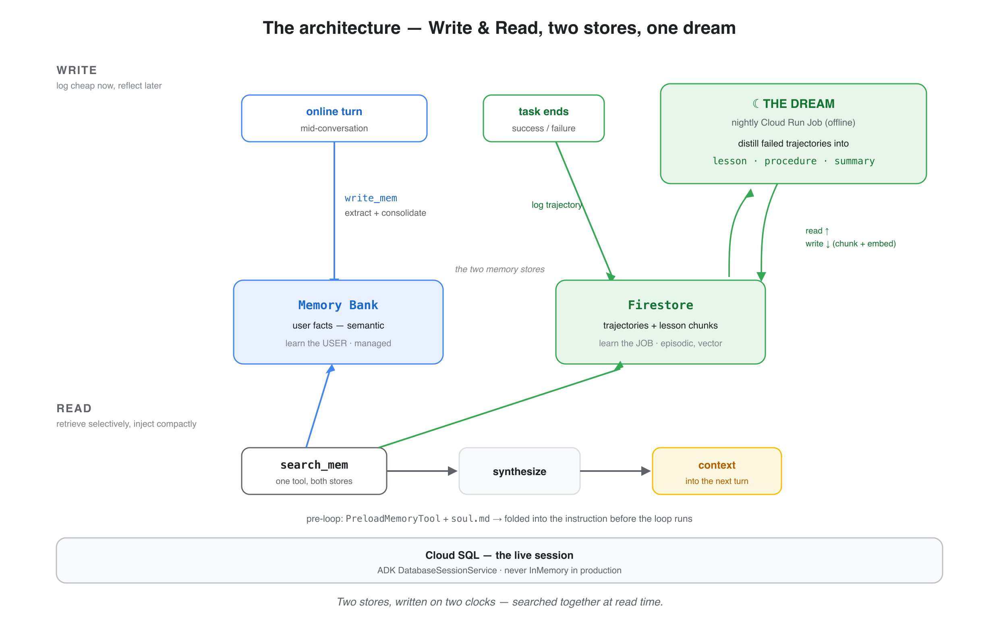
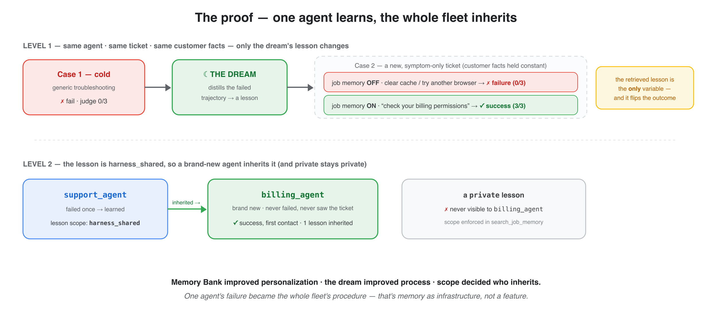

# reflective-memory-harness

> An agent skill that turns **one sentence** into a working, two-store **reflective-memory** AI agent on Google Cloud — with the three traps that bite everyone already handled.



Hand this skill to **Google Antigravity** (or **Claude Code**) and ask, in plain English:

> *“Build me a reflective-memory support agent on Google Cloud.”*

…and your agentic IDE scaffolds an agent that doesn’t just *store* conversations but **learns** from them — durable user facts via **Vertex AI Memory Bank**, *and* lessons distilled from its own past failures via **Firestore + a scheduled offline “dream.”** It’s the open, build-your-own version of a managed background-memory service — your own *Dreams*, on your stack.

A skill is just a `SKILL.md` folder your IDE loads when the task calls for it. This one carries the architecture from a five-part series **plus** the fixes that took real GCP runs to find — so the build comes out right the first time.

## Why install it instead of prompting from scratch

Three non-obvious traps each cost a real debugging session. The skill writes the fix down, so your IDE never hits them:

| Trap | Without the skill | The guardrail it enforces |
|---|---|---|
| **Fire-and-forget amnesia** | the agent stores nothing | synchronous `add_events_to_memory(..., wait_for_completion=True)` |
| **The 3072-dim wall** | Firestore’s vector index won’t build | `text-embedding-005` (768-dim), under the 2048 cap |
| **`--oauth` vs `--oidc`** | the scheduled “dream” silently never fires | `--oauth-service-account-email` on the Scheduler job |

## What it builds

- **Learn-the-user** — at session end, reflect the conversation into Memory Bank (durable per-user facts). Recall with `PreloadMemoryTool` / `search_memory`.
- **Learn-the-job** — log each finished task as a *trajectory* in Firestore; an offline **dream** (a Cloud Run Job on a schedule) distills the *failed* ones into `{lesson, procedure}`, embeds them, and indexes them for similarity search.
- **One `recall()`** that merges both stores into a single context the agent acts on.

And it’s verifiable — the reference implementation reproduces this every run:



## What’s inside the skill

```
reflective-memory-harness/
  SKILL.md                    architecture, build plan, and six non-negotiable guardrails
  resources/
    gotchas.md                the verified traps + fixes
    reference-snippets.md     the load-bearing, verified API calls
```

The six guardrails the builder agent can’t ignore:

1. Reflect into Memory Bank **synchronously** (`wait_for_completion`) — never fire-and-forget.
2. Embeddings: **`text-embedding-005` (768-dim)**, not the 3072-dim default.
3. Scheduler → Cloud Run Job uses **`--oauth`**, not `--oidc`.
4. Every trajectory carries an **outcome + resolution/root cause** (or the dream learns noise).
5. Every memory chunk carries a **scope + `source_trajectory`**, enforced at retrieval (no leakage; revocable).
6. **Cloud SQL** sessions (never InMemory in prod); least-privilege service account; ADC — no key files.

## Install

**Google Antigravity** — copy the skill into your Antigravity skills directory (Workspace or Global Skills):
```bash
git clone https://github.com/cuppibla/reflective-memory-skill
cp -r reflective-memory-skill/reflective-memory-harness <your-antigravity-skills-dir>/
```

**Claude Code** — same skill, different folder:
```bash
cp -r reflective-memory-skill/reflective-memory-harness ~/.claude/skills/     # personal
# or  .claude/skills/  for one project
```

Then open a project and ask for *“a reflective-memory agent on Google Cloud.”* See **[examples/example-session.md](examples/example-session.md)** for exactly what comes out.

## See also

- **Reference implementation (runnable):** https://github.com/cuppibla/reflective-memory-demo
- **The walkthrough:** *“Vibe-Code Your Own Agent ‘Dreams’ in Google Antigravity”* (Part 5 of the Reflective Memory series).

## License

[MIT](LICENSE) © 2026 Annie Wang
